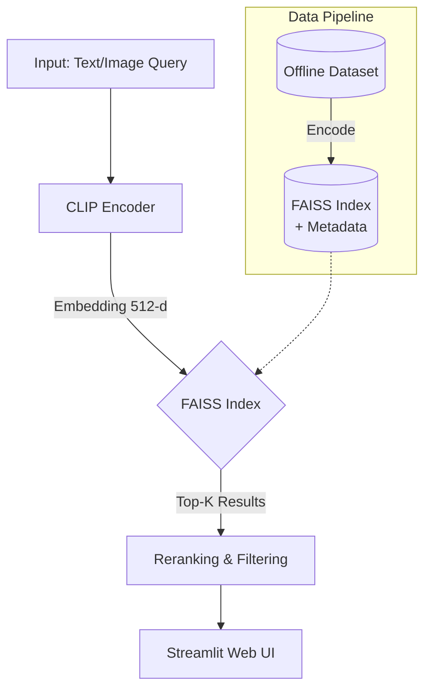

<div align="center">
  

  # Vision Retrieval Project 👁️🔍

  <p>
    <strong>A high-performance Multimodal Image Retrieval System using CLIP & FAISS</strong>
  </p>

  <!-- Badges -->
  <p>
    <a href="https://github.com/QuyeN1104/Vision-Retrieval-Project/stargazers">
      
    </a>
    <a href="LICENSE">
      
    </a>
    <a href="https://www.python.org/downloads/release/python-3130/">
      
    </a>
  </p>
</div>


## 📸 Demo


<div align="center">
  <!-- Place your GIF here -->
  
</div>

### App Screenshots
<p align="center">
  
  
</p>


## 🌟 Overview

**Vision Retrieval** là hệ thống tra cứu và trích xuất hình ảnh đa phương thức (Multimodal). Dự án kết hợp sức mạnh thấu hiểu ngữ nghĩa của mô hình **CLIP** và tốc độ tìm kiếm vector hàng triệu chiều của **FAISS** để mang lại trải nghiệm tìm kiếm ảnh chính xác trong tích tắc. 

Ứng dụng lý tưởng để trích xuất các khung hình (keyframes) từ các video lớn, duyệt ảnh thông minh mà không cần gắn thẻ (tagging) thủ công.

### Tính năng cốt lõi:
- ✍️ **Text-to-Image Search**: Tìm kiếm hình ảnh bằng câu lệnh ngôn ngữ tự nhiên (Zero-shot).
- 🖼️ **Image-to-Image Search**: Tìm kiếm ảnh tương đồng bằng cách upload một hình ảnh mẫu hoặc chọn ảnh có sẵn.
- ⚡ **Real-time Vector Search**: Tốc độ phản hồi tính bằng mili-giây nhờ FAISS (FlatL2 / Inner Product index).
- 📊 **Thống kê & Trực quan**: Tích hợp các bộ lọc (Filters) và biểu đồ phân phối điểm số tương đồng (Score distribution chart).
- 🧩 **Out-of-the-box**: Hỗ trợ tập dữ liệu mẫu (Sample Dataset) tích hợp sẵn, chỉ 1 lệnh chạy là lên hình ngay!


## 🛠️ Architecture




## 🚀 Quick Start (Zero Setup)

Dự án đã tích hợp sẵn một **tập dữ liệu mẫu (Sample Dataset)** cùng FAISS Index được build sẵn. Nhờ đó, bạn có thể chạy thử ứng dụng ngay mà không tốn công cấu hình phức tạp.

### Yêu cầu
- Python >= 3.13
- Khuyên dùng [**uv**](https://github.com/astral-sh/uv) (Trình quản lý package siêu tốc).

### Chạy ứng dụng ngay lập tức
```bash
# 1. Clone dự án
git clone https://github.com/your-username/vision-retrieval-project.git
cd vision-retrieval-project

# 2. Cài đặt các thư viện (nếu dùng uv)
uv sync

# 3. Khởi động Web App
uv run streamlit run app.py
```
> Truy cập ứng dụng tại `http://localhost:8501`. Mặc định ứng dụng sẽ tự động tải 20 ảnh test được cung cấp sẵn!


## 🔧 Advanced Setup (Với Custom Dataset)

Khi bạn muốn sử dụng tập dữ liệu lớn của riêng bạn (ví dụ: 10,000+ keyframes).

### Bước 1: Chuẩn bị dữ liệu
Lưu trữ toàn bộ dữ liệu ảnh của bạn vào thư mục `data/images/`. Hệ thống sẽ tự động quét đệ quy các thư mục con để tìm ảnh (`.jpg`, `.png`).

### Bước 2: Khởi tạo Vector Index (Build Index)
Chạy script để encode toàn bộ tập dữ liệu thành vector và lưu thành FAISS index.

```bash
uv run python scripts/build_index.py --data-dir data/images --output-dir data/index
```
*(Quá trình này sẽ sử dụng GPU nếu có và có thể mất vài phút tùy vào số lượng ảnh).*

### Bước 3: Cấu hình biến môi trường
Tạo file `.env` để trỏ ứng dụng về thư mục Index vừa build:
```bash
cp .env.example .env
```
Mở file `.env` và sửa dòng `INDEX_PATH`:
```env
INDEX_PATH=data/index/faiss.index
```

### Bước 4: Chạy App
```bash
uv run streamlit run app.py
```


## 📂 Project Structure

```text
vision-retrieval-project/
├── app.py                        # Streamlit web application
├── config.py                     # Pydantic Settings & Defaults
├── data/                         
│   ├── sample_images/            # Tập ảnh mẫu (Out-of-the-box testing)
│   ├── sample_index/             # FAISS index cho tập mẫu
│   └── images/                   # (Ignored) Nơi chứa dataset thật
├── scripts/                      
│   └── build_index.py            # CLI Tool để build vector index
├── src/
│   ├── data/                     # Data loaders (hỗ trợ đọc file đệ quy)
│   ├── model/                    # Model wrappers (OpenAI CLIP)
│   ├── pipeline/                 # Retrieval Pipeline orchestration
│   ├── search/                   # Quản lý FAISS engine
│   └── utils/                    # Logs, Matplotlib visualizations
├── tests/                        # Pytest suites
└── pyproject.toml / uv.lock      # Package manager
```


## 👥 Đội ngũ Phát triển & Phân công

Dự án được phân bổ công việc theo nguyên tắc **Agile** trong 3 Sprints với các vai trò chuyên môn được định nghĩa rõ ràng:
- **Project Manager / Tech Lead**: Quản lý tiến độ, thiết kế kiến trúc và setup CI/CD.
- **AI / Model Engineer**: Tích hợp mô hình CLIP, xử lý embedding và tinh chỉnh hiệu suất.
- **Data / Search Engineer**: Xử lý dữ liệu, xây dựng FAISS vector index.
- **Pipeline / QA Engineer**: Xây dựng luồng Retrieval Pipeline và đánh giá (Evaluation).
- **UI / UX Engineer**: Phát triển giao diện Streamlit, trực quan hóa biểu đồ và kết quả.

*(Chi tiết các tasks, metrics và roles vui lòng tham khảo file [plan.md](./plan.md))*.


## 🌟 Star History

<a href="https://www.star-history.com/?type=date&repos=QuyeN1104%2FVision-Retrieval-Project">
 <picture>
   <source media="(prefers-color-scheme: dark)" srcset="https://api.star-history.com/chart?repos=QuyeN1104/Vision-Retrieval-Project&type=date&theme=dark&legend=top-left" />
   <source media="(prefers-color-scheme: light)" srcset="https://api.star-history.com/chart?repos=QuyeN1104/Vision-Retrieval-Project&type=date&legend=top-left" />
   
 </picture>
</a>


## 📝 License

Dự án được phân phối dưới giấy phép **MIT License**. Xem file `LICENSE` để biết thêm chi tiết. Điều này có nghĩa là bạn có thể tự do sử dụng, sao chép, chỉnh sửa, gộp, xuất bản, phân phối, cấp phép lại và/hoặc bán các bản sao của Phần mềm.

<p align="center">
  <i>Được xây dựng với ❤️ bởi Prize_Hunter (AI Conquer 2026).</i>
</p>
