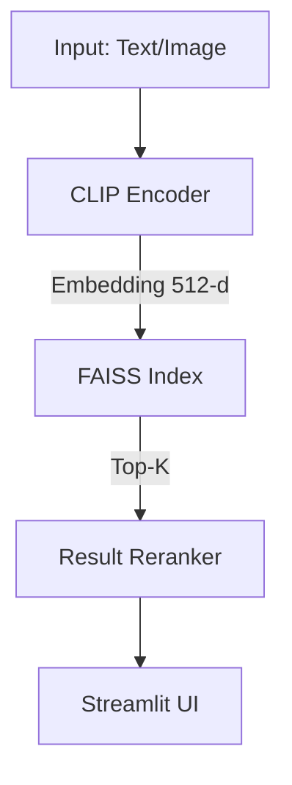

# Vision Retrieval Project 👁️🔍

Hệ thống truy vấn hình ảnh (Image Retrieval) sử dụng kiến trúc **CLIP + FAISS + Streamlit**. Dự án cho phép tìm kiếm hình ảnh tương đồng dựa trên hai phương pháp:
- **Text Query**: Tìm kiếm hình ảnh bằng văn bản mô tả.
- **Image Upload**: Tìm kiếm hình ảnh tương đồng bằng cách upload một hình ảnh mẫu.

## 🌟 Tính năng nổi bật

- **Zero-shot Retrieval**: Sử dụng `openai/clip-vit-base-patch32` để trích xuất đặc trưng (embedding) từ ảnh và văn bản.
- **Fast Vector Search**: Sử dụng `FAISS` (Facebook AI Similarity Search) để tối ưu hóa tìm kiếm Top-K vector nhanh và chính xác.
- **Web UI Mượt mà**: Tương tác trực tiếp bằng trình duyệt qua giao diện **Streamlit**.
- **Cấu trúc Module**: Codebase được thiết kế theo chuẩn, dễ dàng scale và test, tách bạch rõ ràng giữa Data, Model, Search và UI.

---

## 🛠️ Kiến trúc Hệ thống



---

## ⚙️ Cài đặt & Setup

Dự án có hỗ trợ bộ quản lý package siêu tốc **`uv`** (khuyên dùng) hoặc `pip` truyền thống.
Python yêu cầu: **>= 3.13**.

### 1. Cài đặt các thư viện
Nếu bạn đang dùng **`uv`**:
```bash
# Đồng bộ hoá và tự động setup môi trường
uv sync
```

Hoặc dùng **`pip`**:
```bash
python -m venv .venv
source .venv/bin/activate  # Trên Windows: .venv\Scripts\activate
pip install -r requirements.txt
```

### 2. Cấu hình biến môi trường
Tạo file `.env` từ file cấu hình mẫu `.env.example`:
```bash
cp .env.example .env
```
Nội dung file cấu hình tham khảo (`.env`):
```env
DATA_DIR=data
INDEX_PATH=data/index/faiss.index
MODEL_NAME=openai/clip-vit-base-patch32
TOP_K=5
```

---

## 🚀 Hướng dẫn Sử dụng

### Bước 1: Chuẩn bị Dữ liệu
Lưu trữ toàn bộ file ảnh gốc vào thư mục `data/images/`.
Đảm bảo file `data/metadata.json` đã được tạo để lưu thông tin về dữ liệu.

### Bước 2: Khởi tạo Index (Xây dựng Vector DB)
Sau khi chuẩn bị dữ liệu xong, chạy script để encode toàn bộ tập dữ liệu thành vector và lưu thành FAISS index.

```bash
python scripts/build_index.py
```
*Lưu ý: Quá trình này tốn nhiều thời gian phụ thuộc vào số lượng tập ảnh và có/không sử dụng GPU.*

### Bước 3: Chạy Streamlit App
Khởi động giao diện tương tác:

```bash
streamlit run app.py
```
Truy cập qua URL hiển thị trên terminal (mặc định là `http://localhost:8501`).

---

## 📂 Cấu trúc Thư mục

```text
vision-retrieval-project/
├── app.py                        # Streamlit app entry point
├── config.py                     # Quản lý cấu hình toàn dự án (Pydantic Settings)
├── data/                         # Thư mục lưu trữ hình ảnh gốc, index và metadata
├── scripts/                      # Các scripts hỗ trợ (build_index, eval_retrieval, bench_latency)
├── src/
│   ├── data/                     # Load dataset, xử lý và chuẩn hóa dữ liệu ảnh
│   ├── model/                    # Model wrappers (CLIP) và các logic caching embeddings
│   ├── pipeline/                 # Các orchestration workflows chính
│   ├── search/                   # Quản lý FAISS index và tính năng Reranking
│   └── utils/                    # System logs, metrics cho đánh giá, visualization
├── tests/                        # Hệ thống Unit và Integration Tests
└── requirements.txt / uv.lock    # Quản lý các thư viện, dependencies
```

---

## 👥 Đội ngũ Phát triển
Dự án được phân bổ công việc theo nguyên tắc Agile trong 3 Sprints với các vai trò chuyên môn được định nghĩa rõ ràng: **Tech Lead**, **Data Engineer**, **Model Engineer**, **Pipeline Engineer** và **UI Engineer**.

*(Chi tiết các tasks, metrics và roles vui lòng tham khảo file `plan.md`)*.
